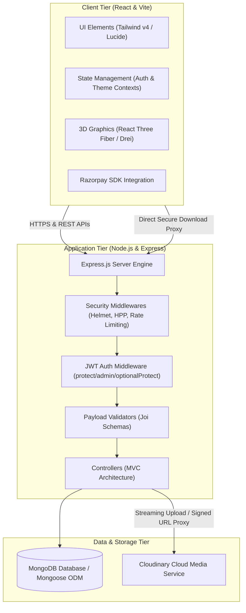
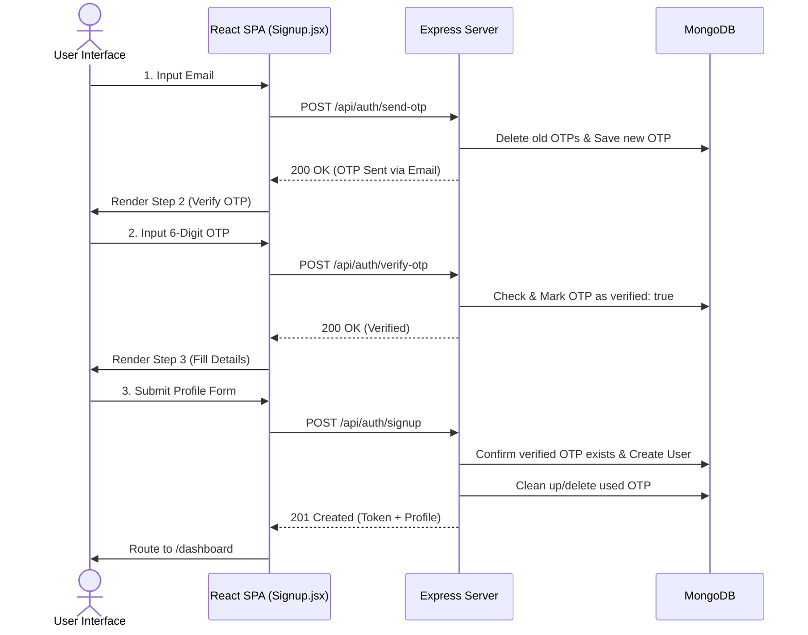
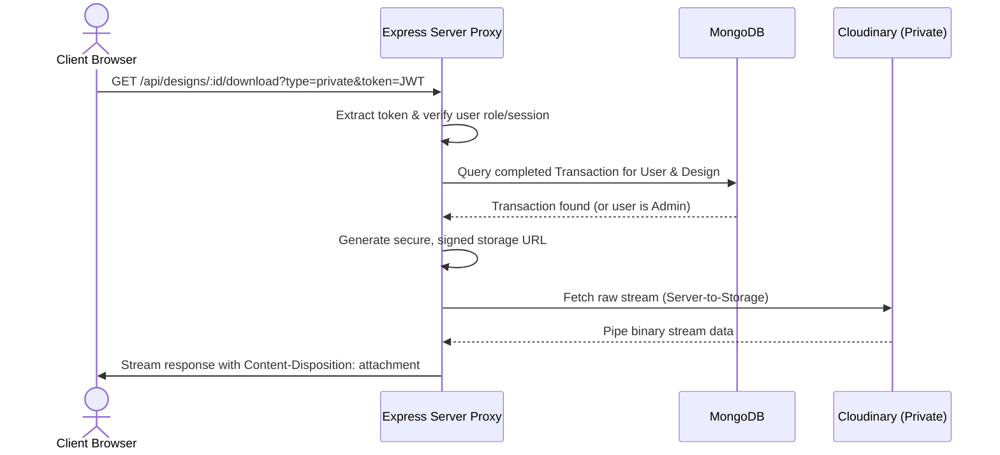
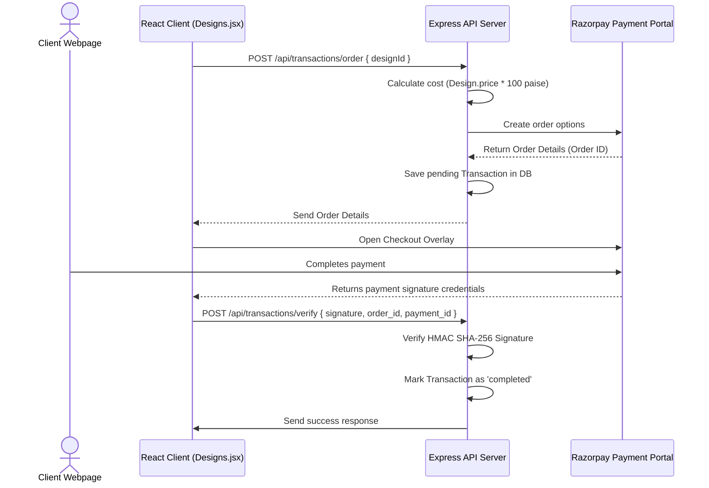

# Technical Deep-Dive & System Architecture: MKPDesigns
This guide serves as a comprehensive developer reference, detailing the architectural decisions, code-level patterns, data flows, and DevOps engineering implemented in the **MKPDesigns** platform. It is structured to help you answer any complex technical questions in a full-stack development interview.

---

## 1. High-Level System Architecture & Technology Stack
MKPDesigns is an enterprise-grade full-stack portfolio and e-commerce application designed under a decoupled **Microservices Architecture**.



### Core Technologies
*   **Frontend:** React 19, Vite 7, Tailwind CSS v4, Framer Motion (for premium UI/UX animations), React Three Fiber & Drei (for rendering interactable 3D models), Axios (API client with interceptors).
*   **Backend:** Node.js (v18/v24), Express.js (REST API framework).
*   **Database:** MongoDB, Mongoose ODM.
*   **Cloud Integrations:** Cloudinary (secure media and asset hosting), Razorpay (secure, cryptographically-verified payment gateway), Nodemailer (SMTP transactional email automation).
*   **DevOps:** Docker (lightweight containerization), Docker Compose (local orchestration), GitHub Actions (Continuous Integration & DevSecOps vulnerability checks), Jenkins (declarative Groovy deployment pipeline).

---

## 2. Server-Side Configurations & Core Architecture

### 2.1 Server Entry Point ([server.js](file:///c:/Users/ashut/OneDrive/Desktop/MKPDesigns/server/server.js))
The entry point initializes Express, connects to MongoDB, sets up DNS servers, configures HTTP security headers, limits body sizes, enforces rate limits, maps REST routes, and handles global errors.
*   **Custom DNS Override:**
    ```javascript
    const dns = require('node:dns');
    try {
      dns.setServers(['8.8.8.8', '1.1.1.1']);
    } catch (error) { ... }
    ```
    *Interview Rationale:* Under Node 24 and Windows environments, DNS resolution can sometimes fail or timeout on local databases or cloud APIs. Overriding the default DNS servers to Google (`8.8.8.8`) and Cloudflare (`1.1.1.1`) ensures deterministic and fast external API resolutions.
*   **Security Configuration:**
    *   **`helmet()`**: Automatically sets secure HTTP headers (e.g., `X-Content-Type-Options`, `Strict-Transport-Security`, `X-Frame-Options` to prevent clickjacking).
    *   **`hpp()`**: Prevents HTTP Parameter Pollution (e.g., passing duplicate query parameters `?user=1&user=2` which can crash array-handling logic in controllers).
    *   **`express-rate-limit`**: Implements a sliding window rate limiter. IPs are capped at `100 requests per 15 minutes` to protect the database against brute force and Distributed Denial of Service (DDoS) attempts.
    *   **Payload Size Limit**: `express.json({ limit: '10kb' })` blocks large JSON payloads early, avoiding memory depletion (buffer overflow exploits).

### 2.2 JWT Authentication Middleware ([auth.js](file:///c:/Users/ashut/OneDrive/Desktop/MKPDesigns/server/middleware/auth.js))
The application features granular security middlewares checking three states:
1.  **`protect`**: Enforces valid JSON Web Tokens (JWT). It checks the `Authorization` header (`Bearer <token>`). If the request is for file downloads, it also checks the query parameters (`?token=...`). It decodes the payload, queries MongoDB for the user (omitting the hashed password using `.select('-password')`), and attaches the user model to `req.user`. If not valid, returns `401 Unauthorized`.
2.  **`admin`**: Checks if `req.user.role === 'admin'`. If not, returns `401 Unauthorized`.
3.  **`optionalProtect`**: A lenient parser. It extracts the JWT if present to populate `req.user` (allowing features like "is this design already purchased by this user?" to render dynamically), but allows the request to continue as a guest (with `req.user` set to `null`) if no token is found, instead of rejecting the call.

### 2.3 Input Payload Validation ([validate.js](file:///c:/Users/ashut/OneDrive/Desktop/MKPDesigns/server/middleware/validate.js))
Instead of validating request bodies imperatively in controller actions, validation is outsourced to a reusable Joi validation middleware.
```javascript
const validate = (schema) => (req, res, next) => {
    const { error } = schema.validate(req.body, { abortEarly: false });
    if (error) {
        const errorMessage = error.details.map((detail) => detail.message).join(', ');
        return res.status(400).json({ message: errorMessage });
    }
    next();
};
```
*   `abortEarly: false` evaluates all payload parameters rather than stopping at the first error, allowing the API to return a comprehensive list of validation issues to the frontend client.

---

## 3. Database Schemas & Data Modeling

All models are defined as Mongoose Schemas mapped to MongoDB collections.

### 3.1 Schemas Overview

| Model / Collection | Key Fields & Types | Indexes & Validation Rules | Architectural Purpose |
| :--- | :--- | :--- | :--- |
| **User** | `name` (String), `email` (String), `password` (String), `googleId` (String), `phone` (String), `organization` (String), `role` (Enum), `preferences` (Sub-document) | Unique email, sparse & unique `googleId` to allow null values, password matches email schema. Has a `pre('save')` hook. | Manages local credentials, OAuth links, roles (User vs Admin), and dashboard settings. |
| **Design** | `title` (String), `description` (String), `imageUrl` (String), `imageId` (String), `price` (Number), `publicUrl` (String), `privateUrl` (String), `category` (Enum) | String trims, enum controls, minimum price check (`min: 0`). | Repositories of designs, blueprints, and assets for sale. Supports free (public) and purchase-locked (private) resources. |
| **Project** | `title`, `description`, `location` (Strings), `estimations` (Sub-document), `status` (Enum), `images` (Array), `model3D` (Sub-document), `modelEmbedUrl` (String) | Enums: `['Proposed', 'Ongoing', 'Completed']` | Manages architectural portfolios, including interactive 3D GLTF models and construction metadata. |
| **OTP** | `email` (String), `otp` (String), `createdAt` (Date), `verified` (Boolean) | **TTL Index (`expires: 300`)**, Compound index on `{ email: 1, createdAt: -1 }`. | Verification registry for multi-stage registration and password resets. |
| **Transaction** | `user` (Ref User), `design` (Ref Design), `amount` (Number), `razorpayOrderId` (String), `razorpayPaymentId` (String), `status` (Enum) | Timestamps enabled. status: `['pending', 'completed', 'failed']` | Ledger tracking payments. Links users to bought design licenses. |
| **Appointment** | `user` (Ref User), `name`, `email`, `date`, `time`, `mode` (Enum), `purpose`, `status` (Enum), `meetingLink` | Mode: `['Video Call', 'Voice Call', 'In-Person']` | Booking system allowing users to arrange architecture consultations. |

### 3.2 Secure Hashing & Cryptography (User Schema Hooks)
*   **Password Encryption**: In [user.js](file:///c:/Users/ashut/OneDrive/Desktop/MKPDesigns/server/models/user.js), password strings are never saved in plain text. A Mongoose `pre('save')` hook automatically intercepts user saves. If the password was modified, it generates a salt with `bcrypt.genSalt(10)` and hashes the password before saving.
*   **Query Protection**: The `password` attribute has `select: false` configured. This prevents Mongoose from returning the hashed password during routine query actions (like fetching a user profile) unless explicitly requested using `.select('+password')`.

---

## 4. Key Client-Side Logic & State Management

### 4.1 Global State Management
1.  **Authentication (`AuthContext`)**: Wrap state and handlers around login, signup, Google login, profile refreshes, and logouts.
    *   Saves the JWT in `localStorage` on successful login/signup.
    *   Attaches `axios` authorization interceptors.
    *   Triggers an initial `checkAuth()` on boot to verify if the token exists, fetches the user's latest details, and redirects them appropriately.
2.  **Theme (`ThemeContext`)**: Manages the application theme (light/dark mode toggle) by writing to the root DOM class list.

### 4.2 Multi-Stage Sign-Up Flow
The [Signup.jsx](file:///c:/Users/ashut/OneDrive/Desktop/MKPDesigns/client/src/pages/Signup.jsx) page implements a 3-step state machine:
1.  **Email Submission**: The user submits their email. React triggers `sendOTP()`. On success, the UI advances to Step 2 and mounts a 60-second visual countdown helper.
2.  **OTP Verification**: The user enters the 6-digit OTP code. The client calls `verifyOTP()`. If the server responds with a verification flag, the UI advances to Step 3.
3.  **Details Completion**: The user enters their name, phone, organization, and password, then submits `signup()`. The server matches this registration payload against the verified OTP registry in MongoDB to register the account.



### 4.3 Google OAuth Integration & Skeleton Profiles
The frontend implements `@react-oauth/google` to trigger a sign-in popup.
1.  On credential return, it decodes the JWT using `jwt-decode` to extract `email`, `name`, `googleId`, and `picture`.
2.  It sends this payload to the backend at `/api/auth/google`.
3.  If the email exists, the account is linked and logged in.
4.  If the email is new, the server creates a **skeleton profile** (storing Google credentials and generating a random dummy password). It marks `isComplete: false` because the application requires a phone number and organization.
5.  The React client receives this flag. If `isComplete === false`, it routes the user to `/complete-profile` where they are prompted to submit their phone and company. Once submitted, it calls `/api/auth/google/complete` to finalize their account.

### 4.4 3D Graphics Integration ([ThreeDViewer.jsx](file:///c:/Users/ashut/OneDrive/Desktop/MKPDesigns/client/src/components/ThreeDViewer.jsx))
Instead of simple static images, the platform utilizes WebGL via React Three Fiber to display interactable 3D models (GLTF/GLB files).
*   **`Canvas`**: The core canvas context.
*   **`useGLTF`**: Pre-loads and parses the binary GLTF/GLB file from Cloudinary asynchronously inside a React `<Suspense>` wrapper.
*   **`Stage`**: Sets up responsive studio lighting, shadows, and environment maps automatically.
*   **`OrbitControls`**: Binds mouse and touch inputs to rotatable controls, with `autoRotate` enabled to showcase the model.

---

## 5. Advanced Backend Systems & Integrations

### 5.1 Cloudinary Storage Integration ([designController.js](file:///c:/Users/ashut/OneDrive/Desktop/MKPDesigns/server/controllers/designController.js))
File management uses `multer` and `multer-storage-cloudinary` to intercept file streams and pipe them directly to Cloudinary.
*   **Multipart Upload Setup**:
    ```javascript
    const uploadFields = upload.fields([
        { name: 'image', maxCount: 1 },
        { name: 'publicResource', maxCount: 1 },
        { name: 'privateDetails', maxCount: 1 }
    ]);
    ```
*   **Handling Raw vs. Image Assets**: Images are uploaded under `resource_type: 'image'` with allowed formats like JPEG/PNG. Dynamic files like PDFs, DOCs, or 3D GLTF assets are uploaded under `resource_type: 'raw'`. Allowed formats must be disabled for raw files to prevent Cloudinary from attempting to transcode them.

### 5.2 Private File Download Proxy
*Interview Hook:* **How do you secure paid digital assets from unauthorized access?**
If you expose a direct URL to a PDF file hosted on AWS S3 or Cloudinary, users can share the URL, bypassing authentication.
MKPDesigns solves this using a **Server-Side File Streaming Proxy**:



1.  The client requests the file from `/api/designs/:id/download?type=private`.
2.  The server extracts the user's session. If the user is not an Admin, it queries MongoDB (`Transaction.findOne({ user, design, status: 'completed' })`). If no transaction is found, it returns `403 Forbidden`.
3.  The server resolves the file ID. Since the file is secure in Cloudinary, the server uses the SDK to generate a time-limited **Signed URL** (`sign_url: true, expires_at: Date.now() + 3600`) specifying `resource_type: 'raw'`.
4.  The server calls `fetch(signedUrl)` to download the file directly inside the Node backend.
5.  It streams the response directly to the user:
    ```javascript
    res.setHeader('Content-Disposition', `attachment; filename="${filename}"`);
    res.setHeader('Content-Type', response.headers.get('content-type'));
    Readable.fromWeb(response.body).pipe(res);
    ```
    This hides the origin URL and ensures that only authenticated, paid users can stream the data.

### 5.3 Razorpay Payment Gateway Integration ([transactionController.js](file:///c:/Users/ashut/OneDrive/Desktop/MKPDesigns/server/controllers/transactionController.js))
The transaction lifecycle is split into two phases to prevent payment tampering:



1.  **Order Creation**:
    *   The client sends a POST request with the `designId`.
    *   The server calculates the price (multiplied by 100, as Razorpay processes transactions in paise).
    *   It initiates the order through the Razorpay SDK.
    *   It creates a **pending transaction record** in MongoDB and returns the order metadata to the client.
2.  **Payment Verification**:
    *   The frontend opens the Razorpay overlay. Upon payment completion, Razorpay returns verification tokens: `razorpay_order_id`, `razorpay_payment_id`, and `razorpay_signature`.
    *   The client sends these details to the server at `/api/transactions/verify`.
    *   The server calculates the expected signature using an **HMAC SHA-256** hash:
        ```javascript
        const body = razorpay_order_id + "|" + razorpay_payment_id;
        const expectedSignature = crypto
            .createHmac('sha256', process.env.RAZORPAY_KEY_SECRET)
            .update(body.toString())
            .digest('hex');
        ```
    *   If the calculated signature matches the one returned by Razorpay, the transaction is marked as `completed` and the database updates.
    *   Finally, the server generates an invoice PDF and emails it to the customer.

### 5.4 Dynamic PDF Generation via Streams
Upon successful payment, the backend generates an invoice on-the-fly using `pdfkit`.
```javascript
const doc = new PDFDocument({ margin: 50 });
const buffers = [];
doc.on('data', buffers.push.bind(buffers));
doc.on('end', () => {
    const pdfData = Buffer.concat(buffers);
    resolve(pdfData);
});
...
doc.end();
```
*   **Stream Mechanics**: Instead of writing the PDF to the server's disk (which consumes disk space and causes I/O bottlenecks), the PDF is generated in memory. The controller catches chunks of binary data, pushes them into a buffer array, and concatenates them on the `end` event. The buffer is then sent directly as an email attachment and streamed to the user via HTTP response.

---

## 6. DevOps Architecture & Infrastructure

The project uses a complete Continuous Integration and Continuous Deployment (CI/CD) workflow.

```mermaid
graph LR
    Dev["Developer Commit"] --> PR["Pull Request (GitHub)"]
    subgraph CI ["GitHub Actions (CI Engine)"]
        Compile["npm run build Check"]
        Audit["DevSecOps Dependency Audit"]
        DryRun["Docker Dry-Run Build"]
    end
    PR --> CI
    CI -- Green Light / Merge --> Main["main branch"]
    
    subgraph CD ["Jenkins (CD Server)"]
        Hook["Git Webhook Trigger"]
        Checkout["Code Checkout"]
        Inject["Vault Secret Injection"]
        Build["Docker Image Build"]
        Deploy["Docker Compose Deployment"]
    end
    
    Main --> Hook --> Checkout --> Inject --> Build --> Deploy --> Prod["Live Application"]
```



### 6.1 Containerization (Docker)
The client and server are split into isolated Docker containers:
*   **Alpine Base Images**: `node:18-alpine` is used. Alpine Linux reduces the container footprint from 900MB to less than 150MB. This minimizes deployment time and decreases potential security vulnerabilities by removing unnecessary system tools.
*   **Caching Layers**: The Dockerfiles copy `package*.json` and run `npm install` *before* copying the source directories. Because Docker caches layers, building the image takes seconds unless packages change.
*   **Vite Network Binding**: The client Dockerfile exposes Vite using the `--host` flag:
    ```dockerfile
    CMD ["npm", "run", "dev", "--", "--host"]
    ```
    This binds Vite to `0.0.0.0`, routing network traffic out of the container so the host browser can access it at `http://localhost:5173`.

### 6.2 Orchestration (Docker Compose)
`docker-compose.yml` configures the multi-container stack:
*   **`depends_on`**: Restricts the boot sequence, ensuring the server starts before the client.
*   **`restart: unless-stopped`**: Enforces a self-healing policy. If a service crashes due to an unhandled exception, Docker restarts it immediately.
*   **`ports`**: Maps container ports to host interfaces (e.g., mapping `5000:5000` to expose the API).

### 6.3 Continuous Integration (GitHub Actions)
Three automated workflows run on every Pull Request to prevent broken code from merging:
1.  **`ci.yml`**: Spins up an Ubuntu VM, installs Node, runs `npm ci` (ensuring clean installs from `package-lock.json`), and attempts a production build (`npm run build`).
2.  **`security.yml`**: Runs `npm audit --audit-level=high` to detect high-risk dependencies early.
3.  **`docker-check.yml`**: Performs a dry-run build (`docker build`) of the client and server Dockerfiles, verifying the infrastructure configuration.

### 6.4 Continuous Deployment (Jenkins Declarative Pipeline)
When code merges into `main`, Jenkins automates the deployment:
*   **Groovy DSL**: The pipeline is managed as code using a `Jenkinsfile` in the repository.
*   **Secret Management (Vault Injection)**:
    Since `.env` files contain sensitive database credentials, they are excluded from Git via `.gitignore`. To allow automated deployments to run successfully, a simulated vault was configured:
    1.  The real environment files are stored in a secure folder (`/var/jenkins_home/secure_envs/`) on the Jenkins host.
    2.  During the build step, Jenkins copies the keys into the workspace:
        ```groovy
        sh "cp /var/jenkins_home/secure_envs/server.env server/.env"
        ```
    3.  This injects the secrets at build-time, keeping passwords secure.

---

## 7. DevOps Troubleshooting & Challenges Faced

### 7.1 Docker-in-Docker (DIND) Isolation Constraints
*   **The Problem**: Jenkins was running inside a Docker container. When the pipeline attempted to run `docker-compose build`, it failed with `docker-compose: command not found`. The container was isolated and could not access the host's Docker engine.
*   **The Solution**: Mount the host's Docker socket into the Jenkins container:
    ```bash
    -v /var/run/docker.sock:/var/run/docker.sock
    ```
    This binds the host's socket to the container's socket. The Docker CLI was then installed inside the Jenkins container, allowing it to communicate with the host's engine.

### 7.2 Git Workspace Security Mismatches (Exit Code 128)
*   **The Problem**: Running Jenkins as the `root` user to allow socket access caused Git to throw a fatal exception: `fatal: not in a git directory (Exit Code 128)`. Git blocked the command because the folder owner ID (Jenkins user `1000`) did not match the execution user (`root`).
*   **The Solution**: Purge the workspace directory using `rm -rf` and run:
    ```bash
    git config --global --add safe.directory '*'
    ```
    This tells Git to bypass owner checks on directories within the container environment.

### 7.3 Network Namespace Conflicts
*   **The Problem**: Deployment failed with `The container name "/mkpdesigns_server" is already in use`. Manual development tests had left active containers running, locking the namespace.
*   **The Solution**: Add cleanup steps before deployment:
    ```bash
    docker rm -f mkpdesigns_server mkpdesigns_client || true
    ```
    This purges old instances, clearing the namespace for a clean run.

---

## 8. Common Technical Interview Questions (and Answers)

### Q: Why do you need both GitHub Actions and Jenkins?
**Answer**: They handle different parts of the development cycle. **GitHub Actions** handles Continuous Integration (CI) and security validation early in the process. It runs on Pull Requests to compile code, check for vulnerabilities, and verify Dockerfiles. Once approved and merged to the main branch, **Jenkins** handles Continuous Deployment (CD). Jenkins runs on the deployment server, injects sensitive keys from its vault, builds the final images, and restarts the containers.

### Q: How do you verify Razorpay payments securely?
**Answer**: Payments are verified using cryptographic signatures on the backend. The frontend payment response includes the `razorpay_order_id`, `razorpay_payment_id`, and `razorpay_signature`. The backend concatenates the order ID and payment ID, hashes the string using HMAC SHA-256 with the secret API key, and compares the result to the signature from the frontend. This prevents users from fabricating transaction IDs or manually setting order states in client code.

### Q: How do you protect paid downloads from unauthorized access?
**Answer**: Paid assets are stored securely on Cloudinary and are not exposed directly to the client. The download request goes through an Express proxy endpoint (`/api/designs/:id/download`). The backend checks if the user's ID matches a completed transaction record in MongoDB. If validated, the server generates a short-lived Signed URL (valid for 1 hour), fetches the file from storage, and streams the binary data to the user.

### Q: How does your Google Auth flow work for new users?
**Answer**: When a user registers with Google, the frontend sends their Google profile details to the backend. If the email doesn't exist, the backend creates a skeleton profile with a random password, but flags `isComplete: false` because phone and organization details are missing. The frontend detects this and routes the user to a page to complete their details, which are then saved to the server to finalize the profile.

### Q: What is the purpose of the custom DNS override in your server entry point?
**Answer**: Under certain development setups (like Node 24 on Windows), DNS resolution can fail or timeout when querying external database endpoints or API services. Overriding the server's default DNS settings with Google (`8.8.8.8`) and Cloudflare (`1.1.1.1`) ensures reliable external network communication.

---
*Good luck with your technical interview!*
